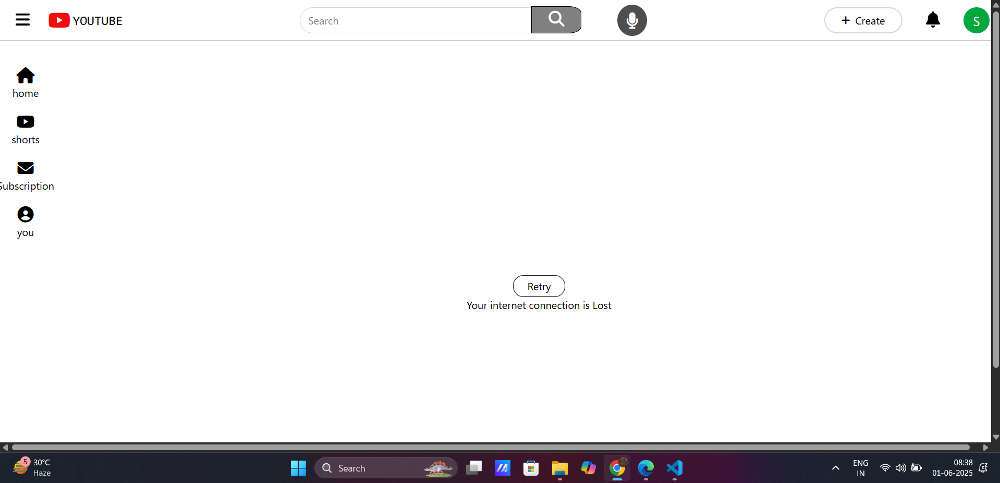

# YouTube UI Clone

## Overview
This project is a clone of the YouTube user interface, built using HTML and styled with Tailwind CSS. It features a responsive design with a navigation bar, search functionality, and a sidebar for easy navigation.

## Features
- Search bar with a magnifying glass icon
- Sidebar with navigation icons

## Installation
To view the project, simply open the `index.html` file in your web browser.

## Screenshots

## License
This project is open-source and available for modification and distribution.